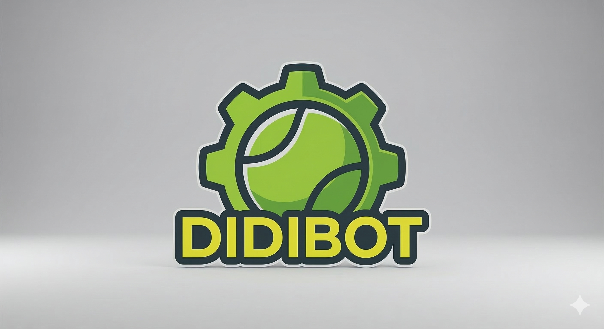

<p align="center">
  
</p>

<h1 align="center">DIDIBOT</h1>
<h3 align="center">Dispositivo Inteligente de Desplazamiento Inalámbrico</h3>
<p align="center">Robot móvil teleoperado para recolección de pelotas de tenis con sistema de remolque intercambiable</p>

<p align="center">
  
  
  
  
</p>

---

## 🎾 Descripción del Proyecto

**DIDIBOT** es un robot tipo coche RC teleoperado diseñado para recolectar pelotas de tenis de forma eficiente durante sesiones de entrenamiento. El proyecto surge de la problemática presentada por un socio formador del ámbito deportivo que requiere una solución accesible para la recolección de pelotas en cancha.

El robot integra:
- **Recolección mecánica pasiva** mediante rodillo frontal y rampa guía
- **Contenedor intercambiable** tipo remolque con sistema de acople/desacople mecánico
- **Tracción diferencial** para alta maniobrabilidad en cancha
- **Sistema de transporte tipo maleta** con manija telescópica retráctil

### 🌐 Demo en Vivo

Abre [`index.html`](index.html) en tu navegador para ver la página web del proyecto con el **render 3D interactivo** del modelo CAD.

---

## 📊 Métricas Objetivo

| Métrica | Objetivo |
|---------|----------|
| Efectividad de recolección | ≥ 90% |
| Cambio de contenedor | < 5 segundos |
| Capacidad por caja | ~30 pelotas |
| Montaje/desmontaje | > 80% efectividad |

---

## 🔧 Diseño Mecánico

### Parte Móvil (Robot)
- **Chasis:** 35 × 25 × 20 cm, placas ensamblables con tornillería y adhesivo
- **Tracción:** 2 motores DC independientes (tracción diferencial) + 2 ruedas locas traseras
- **Recolección:** Rodillo frontal con motor dedicado + bandas de transmisión + rampa guía inclinada
- **Control:** Teleoperado por control remoto inalámbrico (cobertura de cancha completa)

### Caja Recolectora
- **Dimensiones:** 30 × 12 × 18 cm
- **Capacidad:** ~30 pelotas de tenis
- **Base perforada** para ventilación y reducción de peso
- **Malla perimetral** para retención de pelotas
- **Bordes abocinados** para facilitar entrada desde rampa

### Sistema de Desacople
Mecanismo puramente mecánico basado en **gancho articulado**:
1. **Acople:** El robot avanza hacia la caja → el gancho encaja automáticamente
2. **Desacople:** Reversa contra pared → fuerza de reacción libera el gancho
3. **Reacople:** Dirigir hacia nueva caja vacía → ciclo completo en < 5 segundos

### Transporte Tipo Maleta
- Manija telescópica retráctil con botón de liberación lateral
- Ruedas de apoyo en la base
- Diseño ergonómico inspirado en equipaje de mano

---

## ⚡ Electrónica

| Componente | Función |
|-----------|---------|
| ESP32 / Arduino Nano | Microcontrolador principal |
| HC-SR04 | Sensor ultrasónico de proximidad |
| Motores DC | Tracción y recolección |
| Driver de motores | Control de velocidad y dirección |
| LEDs | Indicadores de estado |
| Batería recargable | Alimentación del sistema |

---

## 📐 Especificaciones de Cancha (ITF)

| Parámetro | Valor |
|-----------|-------|
| Longitud total | 23.77 m |
| Ancho (individuales) | 8.23 m |
| Ancho (dobles) | 10.97 m |
| Altura de red (centro) | 0.914 m |
| Diámetro pelota | 6.54 – 6.86 cm |
| Peso pelota | 56 – 59.4 g |

---

## 🗂️ Estructura del Repositorio

```
didibot/
├── index.html          # Página web con render 3D interactivo
├── README.md           # Este archivo
├── assets/
│   └── didibot_logo.png
├── cad/
│   ├── Proyecto_carrito_tennis.STL   # Modelo CAD del robot
│   └── caja.STL                      # Modelo CAD de la caja
└── docs/
    └── DidiBot_Reporte.pdf           # Reporte técnico documentado
```

---

## 🖥️ Tecnologías del Sitio Web

La página web fue desarrollada como un single-page application estático con:

- **Three.js (r128)** — Motor de renderizado 3D en WebGL
- **STL Parser** — Parsing binario de modelos CAD embebidos en base64
- **CSS Custom Properties** — Sistema de diseño con variables
- **Intersection Observer** — Animaciones de scroll reveal
- **Google Fonts** — Orbitron, Rajdhani, Space Mono

### Render 3D Incluye:
- Modelo del robot con material metálico y acentos de color
- Caja recolectora con malla/cage perimetral
- Cancha de tenis con líneas reglamentarias y red
- Pelotas de tenis dispersas en cancha y dentro de la caja
- Iluminación de estudio (key, fill, rim, ambient)
- Controles interactivos: rotar, zoom, pan
- Auto-rotación con damping

---

## 👥 Equipo

| Nombre | Matrícula |
|--------|-----------|
| Carlos Jesús Torres Rosas | A01614808 |
| Luis Ángel Álvarez Bárcenas | A01614821 |
| Ayax Hernán Zavala Delgadillo | A01614776 |
| Isaac Vergara Castillo | A01612977 |
| Luciano Casaubon de los Santos | A01614846 |
| José Fernando Hernández Galván | A01614663 |

**Curso:** Integración Mecatrónica  
**Profesor:** Dr. Moisés García Martínez  
**Institución:** Tecnológico de Monterrey — Campus San Luis Potosí  
**Fecha límite:** 12 de junio, 2026

---

## 📄 Licencia

Proyecto académico desarrollado para el curso de Integración Mecatrónica del Tecnológico de Monterrey, Campus San Luis Potosí. Semestre Febrero-Junio 2026.
